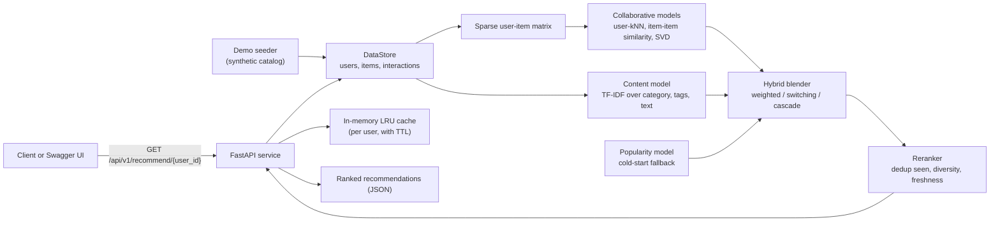

# Realtime Recommendation Engine

A recommendation service for an item catalog. You give it users, items, and a
log of interactions (views, clicks, ratings, purchases), and it answers the
question "what should this user see next?" over an HTTP API. It combines two
classic approaches, collaborative filtering and content-based filtering, into a
hybrid ranker, and falls back to popularity for users it knows nothing about yet.

It runs with no API keys. In demo mode it seeds a synthetic catalog on startup,
so you can call the recommendation endpoint and get real ranked results within a
minute of starting it.

## How the recommendations work, in plain language

The engine blends three ideas:

**Collaborative filtering** looks at behavior, not content. The core idea is
"people who interacted with the same things tend to want the same things." If
you and another user both engaged with a similar set of items, then items that
user liked and you have not seen yet are good candidates for you. This engine
implements three collaborative variants:

- User-based: find the users most similar to you (nearest neighbors by cosine
  similarity over the interaction matrix) and recommend what they engaged with.
- Item-based: treat items as similar when the same users interact with them, and
  recommend items similar to the ones you already touched.
- Matrix factorization: use SVD to learn a small set of latent factors that
  explain the interaction matrix, then predict scores for unseen items.

Collaborative filtering has one weakness: it cannot say anything about a brand
new item that nobody has interacted with, or a brand new user with no history.
This is the cold-start problem.

**Content-based filtering** fills that gap by looking at the items themselves.
Each item has a category, tags, and a text description. The engine turns that
text into a TF-IDF vector and measures similarity between items with cosine
similarity. If you engaged with a few items, it recommends other items whose
text is similar, even if no one else has touched them yet.

**Hybrid recommendation** combines the two so the strengths cover each other's
weaknesses. This engine offers three strategies:

- weighted (default): blend the collaborative and content scores with fixed
  weights (0.6 collaborative, 0.4 content) and rank by the combined score.
- switching: use collaborative filtering when the user has enough history,
  otherwise use content-based.
- cascade: content-based proposes a broad candidate set, collaborative reranks it.

For a user with no history at all, the hybrid model falls back to popularity
(most interacted items, or trending in a recent window). After scoring, a
reranker removes items the user has already seen, limits how many items share a
category for diversity, and applies a small freshness adjustment.

## Architecture and data flow



A request for a user's recommendations first checks the per-user cache. On a
miss, the hybrid model scores candidates using the collaborative models (built
from the sparse user-item matrix) and the content model (built from item text),
blends them, falls back to popularity if there is nothing to score, reranks with
business rules, caches the result, and returns it. New interactions posted to the
API are written to the store and invalidate that user's cached recommendations.

## Run it locally with Docker

From the repository root:

```bash
docker compose -f docker/docker-compose.yml up -d --build api
```

Then open the interactive API docs at **http://localhost:8220/docs**.

The port is 8220, chosen so this stack does not collide with sibling projects
(llm-guardrails-safety on 8100, ml-monitoring-dashboard on 8210). The compose
project is named `realtime-recommendation-engine`.

On startup the service seeds a synthetic construction-supply catalog (200 users
with ids `user_0` to `user_199`, 80 items with ids `item_0` to `item_79`, and
4000 interactions), controlled by `REC_SEED_DEMO_DATA` (default true). Set it to
false to start with an empty catalog and load your own data through the API.

Check it is healthy:

```bash
curl http://localhost:8220/health
# {"status":"healthy","n_users":200,"n_items":80,"n_interactions":4000,"models_fitted":true}
```

Stop it:

```bash
docker compose -f docker/docker-compose.yml down
```

### Without Docker

```bash
pip install -e ".[dev]"
make serve
# http://localhost:8000/docs
```

## What the screenshot shows

There is no separate UI. The screenshot surface is the FastAPI Swagger page at
`/docs`, which lists every endpoint and lets you call them in the browser.

The headline call is the recommendation endpoint. Expand
`GET /api/v1/recommend/{user_id}`, click "Try it out", enter `user_0`, and click
"Execute". The response is a ranked list of recommendations, each with an item
id, a score, a human-readable reason, and the model that produced it. For a
seeded user this returns hybrid results, for example:

```bash
curl "http://localhost:8220/api/v1/recommend/user_0?k=5"
```

```json
{
  "user_id": "user_0",
  "recommendations": [
    {"item_id": "item_1", "score": 7.48, "reason": "Similar users liked this item", "model_used": "hybrid_weighted"},
    {"item_id": "item_2", "score": 4.97, "reason": "Similar users liked this item", "model_used": "hybrid_weighted"}
  ],
  "count": 5,
  "cached": false
}
```

## API reference

Interactive docs at `/docs`. All recommendation routes are under `/api/v1`.

| Method | Endpoint | Description |
|--------|----------|-------------|
| GET | `/api/v1/recommend/{user_id}` | Ranked recommendations (query: `k`, `strategy`) |
| GET | `/api/v1/similar/{item_id}` | Items similar to a given item (content-based) |
| GET | `/api/v1/trending` | Trending items in a recent window (query: `k`, `window_hours`) |
| POST | `/api/v1/interact` | Record a user-item interaction |
| POST | `/api/v1/users` | Create a user |
| POST | `/api/v1/items` | Create an item |
| POST | `/api/v1/evaluate` | Offline evaluation with a temporal train/test split |
| GET | `/health` | Health check with catalog counts |
| GET | `/metrics` | Prometheus metrics |

The `strategy` query parameter on the recommend endpoint accepts `weighted`
(default), `switching`, or `cascade`.

## Offline evaluation

`POST /api/v1/evaluate` splits the interaction log by time (earlier for training,
later for testing), fits the models on the training portion, and scores them on
the held-out portion. It reports precision@k, recall@k, NDCG@k, MAP@k, hit rate,
MRR, plus catalog coverage, intra-list diversity, and novelty.

## Tech stack

- API: FastAPI and Uvicorn
- Recommendation math: NumPy, SciPy (sparse matrices, SVD), scikit-learn
  (nearest neighbors, TF-IDF, cosine similarity)
- Caching: in-memory LRU with a time-to-live (the compose file also bundles
  Redis, which is available for future use but is not required by the current cache)
- Metrics: prometheus-client
- Tests: pytest (219 tests)

## Development

```bash
make dev               # install with dev dependencies
make test              # run the full test suite
make test-unit         # unit tests only
make test-integration  # integration tests only
make lint              # run the linter
make type-check        # run the type checker
make generate          # generate a synthetic dataset under ./data/store
```

## License

MIT
